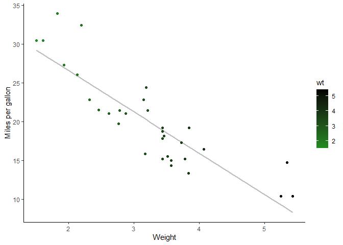
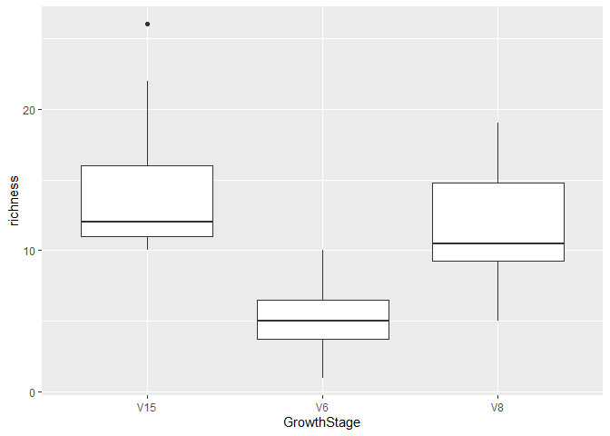

## Packages needed for these notes:

``` r
library(tidyverse)
```

    ## Warning: package 'tidyverse' was built under R version 4.3.3

    ## Warning: package 'ggplot2' was built under R version 4.3.3

    ## Warning: package 'tidyr' was built under R version 4.3.2

    ## Warning: package 'readr' was built under R version 4.3.2

    ## Warning: package 'dplyr' was built under R version 4.3.2

    ## Warning: package 'stringr' was built under R version 4.3.2

    ## Warning: package 'lubridate' was built under R version 4.3.2

    ## ── Attaching core tidyverse packages ──────────────────────── tidyverse 2.0.0 ──
    ## ✔ dplyr     1.1.4     ✔ readr     2.1.5
    ## ✔ forcats   1.0.0     ✔ stringr   1.5.1
    ## ✔ ggplot2   3.5.1     ✔ tibble    3.2.1
    ## ✔ lubridate 1.9.3     ✔ tidyr     1.3.1
    ## ✔ purrr     1.0.4     
    ## ── Conflicts ────────────────────────────────────────── tidyverse_conflicts() ──
    ## ✖ dplyr::filter() masks stats::filter()
    ## ✖ dplyr::lag()    masks stats::lag()
    ## ℹ Use the conflicted package (<http://conflicted.r-lib.org/>) to force all conflicts to become errors

``` r
library(lme4)
```

    ## Warning: package 'lme4' was built under R version 4.3.3

    ## Loading required package: Matrix

    ## Warning: package 'Matrix' was built under R version 4.3.3

    ## 
    ## Attaching package: 'Matrix'
    ## 
    ## The following objects are masked from 'package:tidyr':
    ## 
    ##     expand, pack, unpack

``` r
# install.packages("packages/emmeans_1.10.6.tar.gz", repos = NULL, type = "source")
library(emmeans)
```

    ## Welcome to emmeans.
    ## Caution: You lose important information if you filter this package's results.
    ## See '? untidy'

``` r
# install.packages("packages/multcomp_1.4-26.tar.gz", repos = NULL, type = "source")
library(multcomp)
```

    ## Loading required package: mvtnorm

    ## Warning: package 'mvtnorm' was built under R version 4.3.3

    ## Loading required package: survival

    ## Warning: package 'survival' was built under R version 4.3.3

    ## Loading required package: TH.data

    ## Warning: package 'TH.data' was built under R version 4.3.3

    ## Loading required package: MASS

    ## Warning: package 'MASS' was built under R version 4.3.2

    ## 
    ## Attaching package: 'MASS'
    ## 
    ## The following object is masked from 'package:dplyr':
    ## 
    ##     select
    ## 
    ## 
    ## Attaching package: 'TH.data'
    ## 
    ## The following object is masked from 'package:MASS':
    ## 
    ##     geyser

``` r
# install.packages("multcompView")
library(multcompView)
```

    ## Warning: package 'multcompView' was built under R version 4.3.3

# Introduction to regression analysis in R

y(hat) = β0 + β1x

where y(hat) = equation - β0 = intercept - β1 = slope - x = x points

The actual modeled line is equal to the equation adds on the error term.
yi = β0 + β1xi + ε~N(0,σ)

where yi (y sub i) = each point on the y axis - β0 = intercept - β1 =
slope - xi = each x point - then ε = error - and N(0,σ) = normal
distribution with: - mean = 0 - standard deviation = sigma

The goal of all of this is to estimate three terms. - slope -
intercept - standard deviation4

*The smaller the SSE and higher the SSR, the smaller the p-value*

*Then, we want to know if it is statistically significant. What is the
chance we get the result? - that is your p-value.*

**Connect in your brain which test I will need to use for my data**

## cont<sup>s</sup> X & cont<sup>s</sup> Y

Loading in cars database as example

``` r
data("mtcars")
```

The variables inside the cars dataset include:

-   mpg = the mpg
-   cyl = number of cylinders
-   disp = displacement
-   hp = gross horsepower
-   drat = rear axle ratio
-   wt = weight
-   qsec = quarter mile time
-   vs = engine shape V = 0 or Straight = 1
-   am = Transmission type; 0 = auto, 1 = manual
-   gear = number of forward gears
-   carb = number of carburetors

If you have two continuous variables you will want a scatter plot

#### Weight vs MPG

``` r
ggplot(mtcars, aes(x = wt, y = mpg)) +
  geom_smooth(method = lm, se = FALSE, color = "grey") +
  geom_point(aes(color = wt)) +
  xlab("Weight") + 
  ylab("Miles per gallon") +
  scale_colour_gradient(low = "forestgreen", high = "black") +
  theme_classic()
```

    ## `geom_smooth()` using formula = 'y ~ x'



This looks to be a general negative relationship, but how can we be
sure?

### linear models

``` r
lm(mpg~wt, data = mtcars)
```

    ## 
    ## Call:
    ## lm(formula = mpg ~ wt, data = mtcars)
    ## 
    ## Coefficients:
    ## (Intercept)           wt  
    ##      37.285       -5.344

``` r
lm1 <- lm(mpg~wt, data = mtcars)
summary(lm1)
```

    ## 
    ## Call:
    ## lm(formula = mpg ~ wt, data = mtcars)
    ## 
    ## Residuals:
    ##     Min      1Q  Median      3Q     Max 
    ## -4.5432 -2.3647 -0.1252  1.4096  6.8727 
    ## 
    ## Coefficients:
    ##             Estimate Std. Error t value Pr(>|t|)    
    ## (Intercept)  37.2851     1.8776  19.858  < 2e-16 ***
    ## wt           -5.3445     0.5591  -9.559 1.29e-10 ***
    ## ---
    ## Signif. codes:  0 '***' 0.001 '**' 0.01 '*' 0.05 '.' 0.1 ' ' 1
    ## 
    ## Residual standard error: 3.046 on 30 degrees of freedom
    ## Multiple R-squared:  0.7528, Adjusted R-squared:  0.7446 
    ## F-statistic: 91.38 on 1 and 30 DF,  p-value: 1.294e-10

## Anovas

Analysis of variance is used for catagorical variables, but can be used
on linear models as well.

``` r
anova(lm1)
```

    ## Analysis of Variance Table
    ## 
    ## Response: mpg
    ##           Df Sum Sq Mean Sq F value    Pr(>F)    
    ## wt         1 847.73  847.73  91.375 1.294e-10 ***
    ## Residuals 30 278.32    9.28                      
    ## ---
    ## Signif. codes:  0 '***' 0.001 '**' 0.01 '*' 0.05 '.' 0.1 ' ' 1

## Correlation Test

``` r
cor.test(mtcars$mpg,mtcars$wt)
```

    ## 
    ##  Pearson's product-moment correlation
    ## 
    ## data:  mtcars$mpg and mtcars$wt
    ## t = -9.559, df = 30, p-value = 1.294e-10
    ## alternative hypothesis: true correlation is not equal to 0
    ## 95 percent confidence interval:
    ##  -0.9338264 -0.7440872
    ## sample estimates:
    ##        cor 
    ## -0.8676594

## Assumptions

In general, there are several assumptions in a regression, linear model,
ANOVA, or whatever you want to call it.

They are:

-   y is continuous
-   error is normally distributed
-   relationship is linear
-   homoskedasticity
-   sigma is consistent
-   independent samples

### Getting residuals from model above

``` r
model <- lm(mpg~wt, data = mtcars)

ggplot(model, aes(y = .resid, x = .fitted)) +
  geom_point() +
  geom_hline(yintercept = 0)
```


## New Dataset - Bull Richness

``` r
bull.rich <- read.csv("../data/Bull_richness.csv")
```

Demonstrating: - Anova w/ two groups (ttest)

-   Anova w/ more than one category MANOVA

``` r
bull.rich.sub <- bull.rich %>%
  filter(GrowthStage == "V8" & Treatment == "Conv.") 
 
  
t.test(richness ~ Fungicide, data = bull.rich.sub)
```

    ## 
    ##  Welch Two Sample t-test
    ## 
    ## data:  richness by Fungicide
    ## t = 4.8759, df = 17.166, p-value = 0.0001384
    ## alternative hypothesis: true difference in means between group C and group F is not equal to 0
    ## 95 percent confidence interval:
    ##   4.067909 10.265425
    ## sample estimates:
    ## mean in group C mean in group F 
    ##       11.750000        4.583333

``` r
summary(lm(richness ~ Fungicide, data = bull.rich.sub))
```

    ## 
    ## Call:
    ## lm(formula = richness ~ Fungicide, data = bull.rich.sub)
    ## 
    ## Residuals:
    ##     Min      1Q  Median      3Q     Max 
    ## -6.7500 -1.7500 -0.6667  2.2500  7.2500 
    ## 
    ## Coefficients:
    ##             Estimate Std. Error t value Pr(>|t|)    
    ## (Intercept)   11.750      1.039  11.306 1.24e-10 ***
    ## FungicideF    -7.167      1.470  -4.876 7.12e-05 ***
    ## ---
    ## Signif. codes:  0 '***' 0.001 '**' 0.01 '*' 0.05 '.' 0.1 ' ' 1
    ## 
    ## Residual standard error: 3.6 on 22 degrees of freedom
    ## Multiple R-squared:  0.5194, Adjusted R-squared:  0.4975 
    ## F-statistic: 23.77 on 1 and 22 DF,  p-value: 7.118e-05

## Multiple Categories

subset data

``` r
bull.rich.sub2 <- bull.rich %>%
  filter(Fungicide == "C" & Treatment == "Conv." & Crop == "Corn")
```

``` r
ggplot(bull.rich.sub2, aes(x = GrowthStage, y = richness)) +
  geom_boxplot()
```



let’s move the bars so the factors are in ascending order

``` r
bull.rich.sub2$GrowthStage <- factor(bull.rich.sub2$GrowthStage, levels = c("V6", "V8", "V15"))

ggplot(bull.rich.sub2, aes(x = GrowthStage, y = richness)) +
  geom_boxplot()
```


``` r
lm3 <- lm(richness ~ GrowthStage, data = bull.rich.sub2)
summary(lm3)
```

    ## 
    ## Call:
    ## lm(formula = richness ~ GrowthStage, data = bull.rich.sub2)
    ## 
    ## Residuals:
    ##    Min     1Q Median     3Q    Max 
    ## -6.750 -2.625 -1.000  2.250 11.583 
    ## 
    ## Coefficients:
    ##                Estimate Std. Error t value Pr(>|t|)    
    ## (Intercept)       5.250      1.208   4.348 0.000124 ***
    ## GrowthStageV8     6.500      1.708   3.806 0.000581 ***
    ## GrowthStageV15    9.167      1.708   5.368 6.23e-06 ***
    ## ---
    ## Signif. codes:  0 '***' 0.001 '**' 0.01 '*' 0.05 '.' 0.1 ' ' 1
    ## 
    ## Residual standard error: 4.183 on 33 degrees of freedom
    ## Multiple R-squared:  0.4803, Adjusted R-squared:  0.4488 
    ## F-statistic: 15.25 on 2 and 33 DF,  p-value: 2.044e-05

same p-value w

``` r
anova(lm3)
```

    ## Analysis of Variance Table
    ## 
    ## Response: richness
    ##             Df Sum Sq Mean Sq F value    Pr(>F)    
    ## GrowthStage  2 533.56 266.778  15.247 2.044e-05 ***
    ## Residuals   33 577.42  17.497                      
    ## ---
    ## Signif. codes:  0 '***' 0.001 '**' 0.01 '*' 0.05 '.' 0.1 ' ' 1

## emmeans and multcomp packages

``` r
lsmeans <- emmeans(lm3, ~GrowthStage) # estimates least-square means of variety within site vs year


Results_lsmeans <- cld(lsmeans, alpha = 0.05, reversed = TRUE, details = TRUE) # contrast with Tukey adjustment by default. 
Results_lsmeans
```

    ## $emmeans
    ##  GrowthStage emmean   SE df lower.CL upper.CL .group
    ##  V15          14.42 1.21 33    11.96    16.87  1    
    ##  V8           11.75 1.21 33     9.29    14.21  1    
    ##  V6            5.25 1.21 33     2.79     7.71   2   
    ## 
    ## Confidence level used: 0.95 
    ## P value adjustment: tukey method for comparing a family of 3 estimates 
    ## significance level used: alpha = 0.05 
    ## NOTE: If two or more means share the same grouping symbol,
    ##       then we cannot show them to be different.
    ##       But we also did not show them to be the same. 
    ## 
    ## $comparisons
    ##  contrast estimate   SE df t.ratio p.value
    ##  V8 - V6      6.50 1.71 33   3.806  0.0016
    ##  V15 - V6     9.17 1.71 33   5.368  <.0001
    ##  V15 - V8     2.67 1.71 33   1.562  0.2763
    ## 
    ## P value adjustment: tukey method for comparing a family of 3 estimates

## Interaction Terms:

The interactions between factors. In other words: what if the effect of
one factor depends on the other?

``` r
bull.rich.sub3 <- bull.rich %>%
  filter(Treatment == "Conv." & Crop == "Corn")

bull.rich.sub3$GrowthStage <- factor(bull.rich.sub3$GrowthStage, levels = c("V6", "V8", "V15"))
```

``` r
# write it like this
lm.inter <- lm(richness ~ GrowthStage + Fungicide + GrowthStage:Fungicide, data = bull.rich.sub3)

# or like this
lm.interB <-lm(richness ~ GrowthStage*Fungicide, data = bull.rich.sub3)


summary(lm.inter)
```

    ## 
    ## Call:
    ## lm(formula = richness ~ GrowthStage + Fungicide + GrowthStage:Fungicide, 
    ##     data = bull.rich.sub3)
    ## 
    ## Residuals:
    ##     Min      1Q  Median      3Q     Max 
    ## -8.5000 -2.4167 -0.4167  2.0625 11.5833 
    ## 
    ## Coefficients:
    ##                           Estimate Std. Error t value Pr(>|t|)    
    ## (Intercept)                 5.2500     1.1029   4.760 1.10e-05 ***
    ## GrowthStageV8               6.5000     1.5597   4.167 9.15e-05 ***
    ## GrowthStageV15              9.1667     1.5597   5.877 1.51e-07 ***
    ## FungicideF                 -1.2500     1.5597  -0.801  0.42575    
    ## GrowthStageV8:FungicideF   -5.9167     2.2057  -2.682  0.00923 ** 
    ## GrowthStageV15:FungicideF   0.3333     2.2057   0.151  0.88034    
    ## ---
    ## Signif. codes:  0 '***' 0.001 '**' 0.01 '*' 0.05 '.' 0.1 ' ' 1
    ## 
    ## Residual standard error: 3.82 on 66 degrees of freedom
    ## Multiple R-squared:  0.5903, Adjusted R-squared:  0.5593 
    ## F-statistic: 19.02 on 5 and 66 DF,  p-value: 1.144e-11

``` r
anova(lm.inter)
```

    ## Analysis of Variance Table
    ## 
    ## Response: richness
    ##                       Df  Sum Sq Mean Sq F value    Pr(>F)    
    ## GrowthStage            2 1065.58  532.79 36.5027 2.113e-11 ***
    ## Fungicide              1  174.22  174.22 11.9363 0.0009668 ***
    ## GrowthStage:Fungicide  2  148.36   74.18  5.0823 0.0088534 ** 
    ## Residuals             66  963.33   14.60                      
    ## ---
    ## Signif. codes:  0 '***' 0.001 '**' 0.01 '*' 0.05 '.' 0.1 ' ' 1

Effect of fungicide depends on the growth stage

three seperate tests: one within each growth stage of the effect of
fungicide. Did not effect richness except v8

``` r
lsmeans <- emmeans(lm.inter, ~Fungicide|GrowthStage) # estimate lsmeans of variety within siteXyear
Results_lsmeans <- cld(lsmeans, alpha = 0.05, reversed = TRUE, details = TRUE) # contrast with Tukey ajustment
Results_lsmeans
```

    ## $emmeans
    ## GrowthStage = V6:
    ##  Fungicide emmean  SE df lower.CL upper.CL .group
    ##  C           5.25 1.1 66     3.05     7.45  1    
    ##  F           4.00 1.1 66     1.80     6.20  1    
    ## 
    ## GrowthStage = V8:
    ##  Fungicide emmean  SE df lower.CL upper.CL .group
    ##  C          11.75 1.1 66     9.55    13.95  1    
    ##  F           4.58 1.1 66     2.38     6.79   2   
    ## 
    ## GrowthStage = V15:
    ##  Fungicide emmean  SE df lower.CL upper.CL .group
    ##  C          14.42 1.1 66    12.21    16.62  1    
    ##  F          13.50 1.1 66    11.30    15.70  1    
    ## 
    ## Confidence level used: 0.95 
    ## significance level used: alpha = 0.05 
    ## NOTE: If two or more means share the same grouping symbol,
    ##       then we cannot show them to be different.
    ##       But we also did not show them to be the same. 
    ## 
    ## $comparisons
    ## GrowthStage = V6:
    ##  contrast estimate   SE df t.ratio p.value
    ##  C - F       1.250 1.56 66   0.801  0.4258
    ## 
    ## GrowthStage = V8:
    ##  contrast estimate   SE df t.ratio p.value
    ##  C - F       7.167 1.56 66   4.595  <.0001
    ## 
    ## GrowthStage = V15:
    ##  contrast estimate   SE df t.ratio p.value
    ##  C - F       0.917 1.56 66   0.588  0.5587

``` r
bull.rich.sub3 %>%
  ggplot(aes(x = GrowthStage, y = richness, fill = Fungicide)) +
  geom_boxplot()
```


## Mixed Effects Models

All mixed-effects mdoels have a common fixed and random effects.

*Common fixed effects* - Treatment * - Species * - Genes

*Common random effects (blocking factor)* - Year * - Replicate * -
Trial - Individuals * - Fields *

(\*) = possible effects for my data

``` r
lm.inter2<-lmer(richness ~ GrowthStage*Fungicide + (1|Rep), data = bull.rich.sub3)
summary(lm.inter2)
```

    ## Linear mixed model fit by REML ['lmerMod']
    ## Formula: richness ~ GrowthStage * Fungicide + (1 | Rep)
    ##    Data: bull.rich.sub3
    ## 
    ## REML criterion at convergence: 378.3
    ## 
    ## Scaled residuals: 
    ##     Min      1Q  Median      3Q     Max 
    ## -2.4664 -0.5966 -0.1788  0.6257  2.9101 
    ## 
    ## Random effects:
    ##  Groups   Name        Variance Std.Dev.
    ##  Rep      (Intercept)  0.7855  0.8863  
    ##  Residual             13.9533  3.7354  
    ## Number of obs: 72, groups:  Rep, 4
    ## 
    ## Fixed effects:
    ##                           Estimate Std. Error t value
    ## (Intercept)                 5.2500     1.1658   4.503
    ## GrowthStageV8               6.5000     1.5250   4.262
    ## GrowthStageV15              9.1667     1.5250   6.011
    ## FungicideF                 -1.2500     1.5250  -0.820
    ## GrowthStageV8:FungicideF   -5.9167     2.1566  -2.743
    ## GrowthStageV15:FungicideF   0.3333     2.1566   0.155
    ## 
    ## Correlation of Fixed Effects:
    ##             (Intr) GrwSV8 GrSV15 FngcdF GSV8:F
    ## GrowthStgV8 -0.654                            
    ## GrwthStgV15 -0.654  0.500                     
    ## FungicideF  -0.654  0.500  0.500              
    ## GrwthSV8:FF  0.462 -0.707 -0.354 -0.707       
    ## GrwtSV15:FF  0.462 -0.354 -0.707 -0.707  0.500

(compare with above)

``` r
summary(lm.inter)
```

    ## 
    ## Call:
    ## lm(formula = richness ~ GrowthStage + Fungicide + GrowthStage:Fungicide, 
    ##     data = bull.rich.sub3)
    ## 
    ## Residuals:
    ##     Min      1Q  Median      3Q     Max 
    ## -8.5000 -2.4167 -0.4167  2.0625 11.5833 
    ## 
    ## Coefficients:
    ##                           Estimate Std. Error t value Pr(>|t|)    
    ## (Intercept)                 5.2500     1.1029   4.760 1.10e-05 ***
    ## GrowthStageV8               6.5000     1.5597   4.167 9.15e-05 ***
    ## GrowthStageV15              9.1667     1.5597   5.877 1.51e-07 ***
    ## FungicideF                 -1.2500     1.5597  -0.801  0.42575    
    ## GrowthStageV8:FungicideF   -5.9167     2.2057  -2.682  0.00923 ** 
    ## GrowthStageV15:FungicideF   0.3333     2.2057   0.151  0.88034    
    ## ---
    ## Signif. codes:  0 '***' 0.001 '**' 0.01 '*' 0.05 '.' 0.1 ' ' 1
    ## 
    ## Residual standard error: 3.82 on 66 degrees of freedom
    ## Multiple R-squared:  0.5903, Adjusted R-squared:  0.5593 
    ## F-statistic: 19.02 on 5 and 66 DF,  p-value: 1.144e-11
